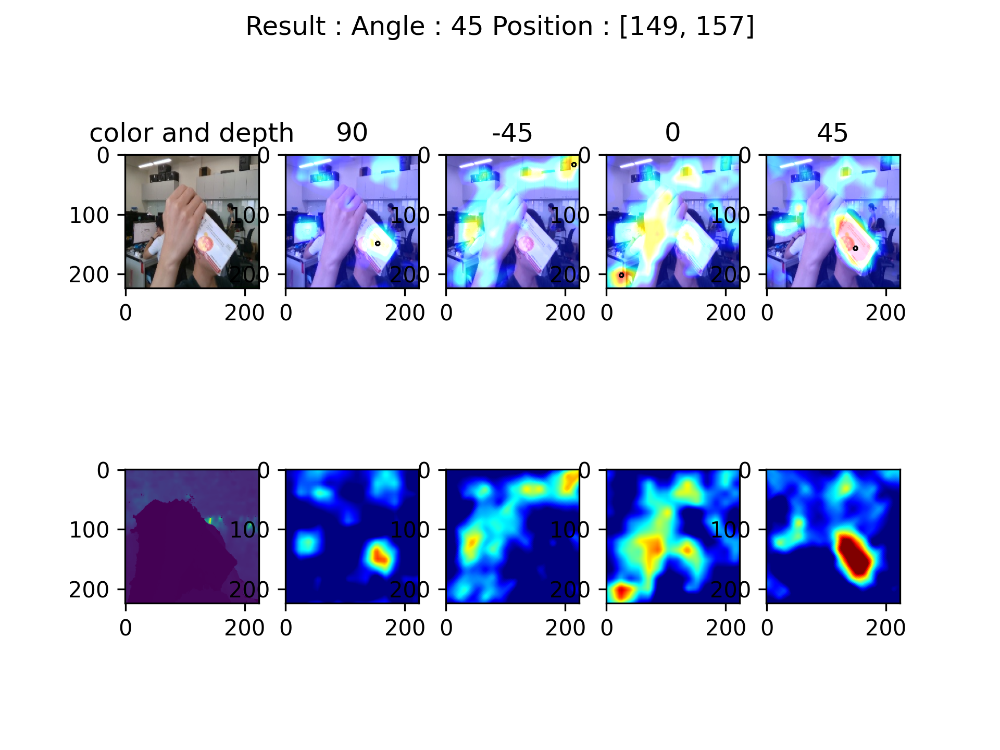

# Grasp_drl

Here is the work to use DQN to predict a "grasping action" by Pytorch .



## Train
```bash
$ python3 offline.py"
```

## Test
```bash
$ python3 test.py"
```

## Evaluation
```bash
$ python3 evaluation.py"
```